 

View the live project [here](https://8000-black-clam-54hfbq3g.ws-eu04.gitpod.io/)

# Olumo Rock History

This website was created for the purpose of providing useful information about the Olumo Rock Tourist Centre to both first time and returning visitors ranging from tourists, students, researchers of history and potential investors alike about the famous Olumo Rock located in Abeokuta, the South Western part of Nigeria in West Africa. 

It is an history website created for christYmet, a subsidiary department under the Ogun State Tourism Board in Nigeria.

The aim of the product owner which is christYmet, is to assist the government in its effort to open up the state for tourism and attract visitors to the Olumo Rock in order to make it a tourist hub within Africa and the world at large thereby providing jobs for the locals which results into economy boost and icrease in revenue generation for the state.  It also aims at preserving the cultural heritage of the Yoruba tribe in South West Nigeria for both the present and future generations.

(TAKE PICTURES OF DESKTOP, LAPTOP, TABLET & SMARTPHONE WITH MY WEBSITE ON THEM AND PUT THEM HERE.)

# Features

It is designed to be responsive on all device sizes and accessible on a range of devices thereby making it easy to navigate through and find useful and relevant content.

## Existing Features

* Navigation Bar

    * It appears on all four pages and is identical across the pages to allow for easy navigation. The full responsive navigation bar consists of the organisation's Logo positioned to the left and the links to the Home Page, "History of Olumo Rock" Page, Gallery Page and the "Contact Us" Page are placed towards the mid-right section of the navigation bar.  

    * The links on the navigation bar are connected together across all pages to allow the user to navigate easily from page to page across all devices without having to go back to the previous page via the 'back' button.

    * See the 'Navigation Bar' Screenshot below:

    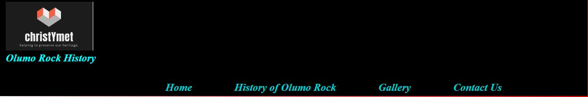

 

* The Home Page Image

    * The home page has an image of the Olumo Rock with a caption of "Olumo Rock" boldly written on it.

    * The image of the rock is boldly positioned there to capture the users attention and make them long for a visit to the rock.

    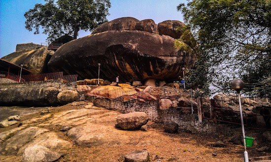

    * Welcome Section

        * The home page has an introduction section called 'Welcome' that welcomes the user to the site. It also gives a brief explanation about the site, the rock and the history surrounding it.

        * See the 'Welcome' Section Screenshot below:

        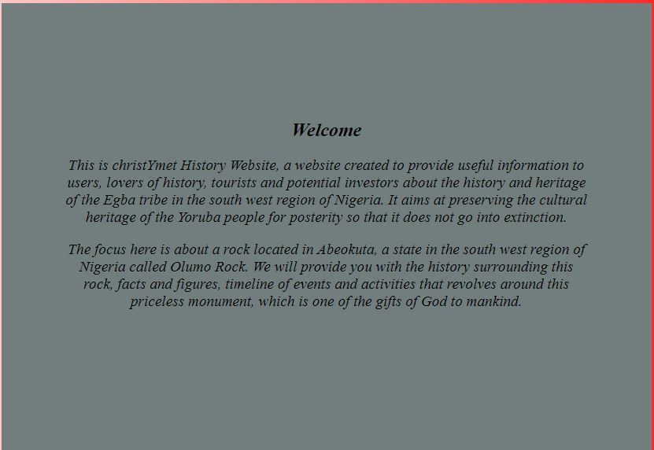

    * Opening Hours & Entry Fee Section

        * This section keeps the user informed about the opening hours and entry fee which is a vital information especially for first time visitors and also returning visitors to monitor changes to opening hours or entry fee since they last visited. This information is vital in the sense that it will help them in planning well ahead of their journey whenever they choose to visit. 

        * See the 'Opening Hours & Entry Fee' Section Screenshot below:

        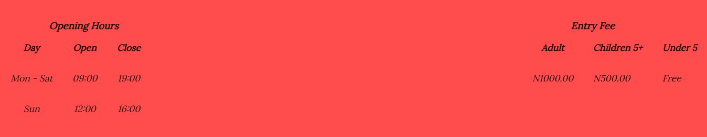

    * Direction and Further Enquiries Section

         * In this section, a user is presented with two external links which are Google Map and Ogun State Government Tourism board website and can access them by the use of the 'Click Me' buttons provided on the page. When any of the buttons is clicked, it will either take them to Google Map site where the location and direction to the tourist centre is, and they can use that as a guide to finding the centre or the State tourism board site for further enquiries.

         * See the 'Direction and Further Enquiries' Section Screenshot below:

        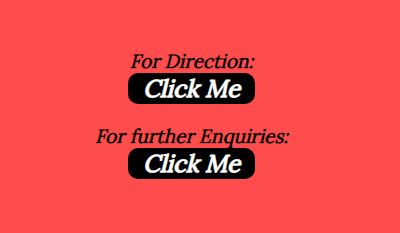
 

* History of Olumo Rock Page

    * This Page gives a detailed history about the rock and provides facts and figures too. It explained the significance of the rock, the hunter who discovered it, the purpose it served during the 19th century war, its location and size.

    * See the 'History of Olumo Rock' Page Screenshot below:

    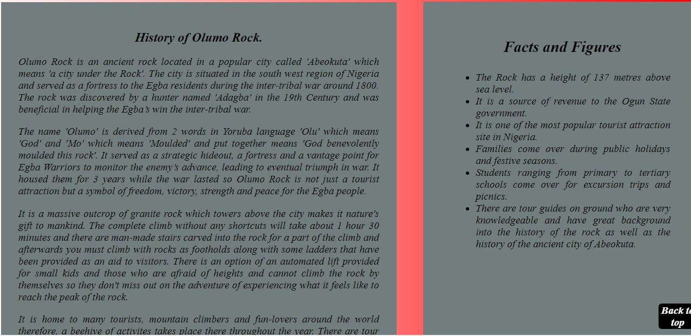
    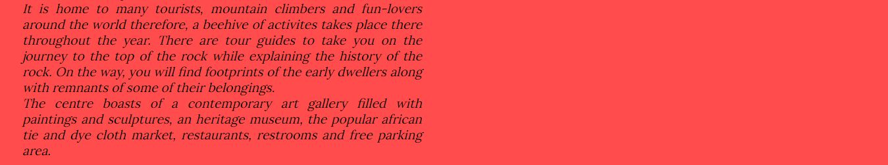 

* Gallery Page

    * This page contains a gallery of pictures. It shows different views of the rock, other side attractions such as the heritage museum, the african version of the 'ludo' game known as 'ayo' which is close to the 'mancala' board game , pictures of visitors and a whole lot more of activities for visitors delight and enjoyment.

     * See the 'Gallery' Page Screenshot below:

    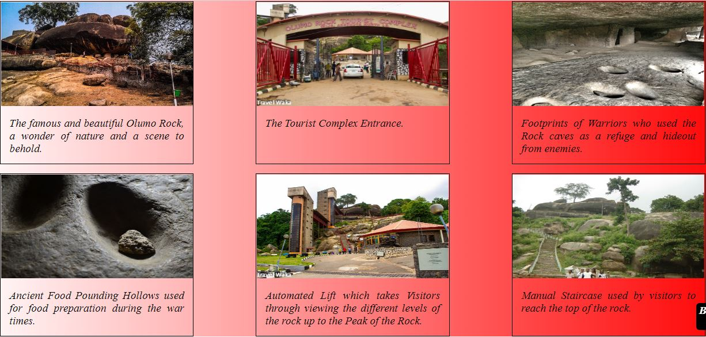
    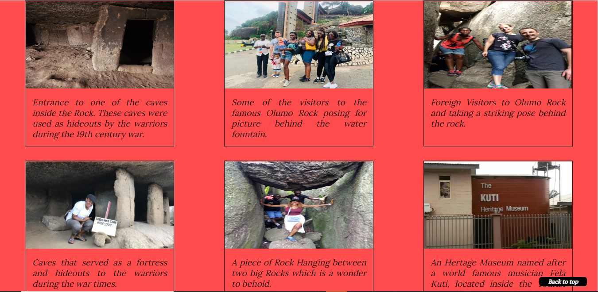
    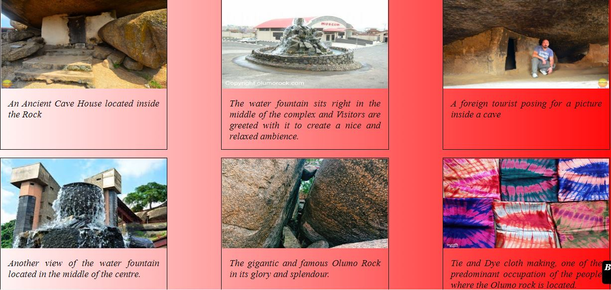
    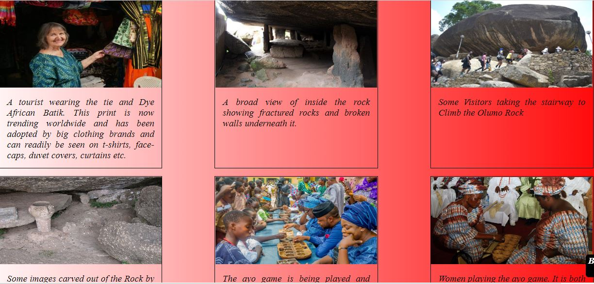
    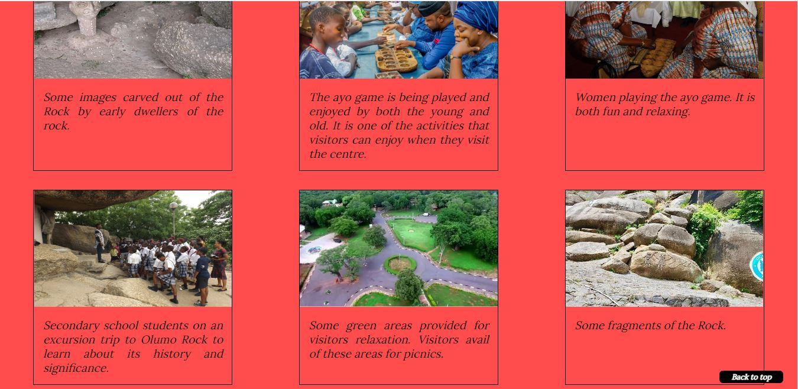
    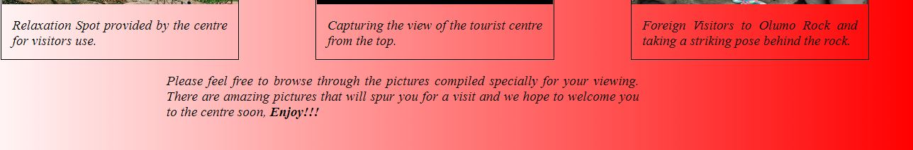

* Contact Us Page

    * This page consists of two sections: the 'Contact Details' and the 'Query/Feedback' form section.  The Contact Details section provides the Phone number, Office and Email address of the website owner christYmet so that users who may need it can access it easily.
    The Query/Feedback section is an HTML form that allow users to send their queries and/or give feedbacks so that the website owner can use this information to further improve on the services being provided. 

    * See the 'Contact Us' Page Screenshot below:

    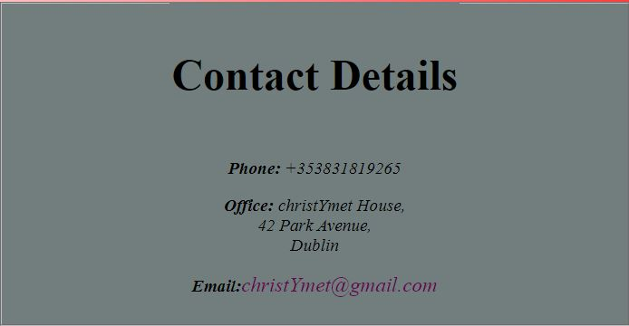

    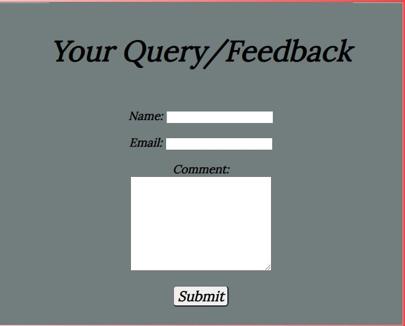

User Experience (UX)

* User stories

    * First Time Visitor Goals

        a) I want to easily understand the main purpose of the site and learn more about the history that surrounds the rock.

        b) I want to be able to navigate easily throughout the site to find useful content.

        c) I want to be able to locate and connect to their social media links to see their followings in order to determine how trusted and popular they are.

        d) I want to be able to make enquiries about the site and historical monument.

    * Returning Visitor Goals

        a) I want to be able to find relevant information about the opening hours, entry fee etc. to see if there are any changes.

        b) I want to find the best way to get in contact with the tourist centre with any questions or feedbacks I may have.

        c) I want to be able to connect to their social media links to provide feedback and get up to date information about upcoming events.

    * Design

        * Colour Scheme

            * Gradient colour ranging from a lighter shade of red to a darker shade are used as background colour throughout the website. It blends well into the font colour of black which is predominantly used for texts on every page.

        *  Typography

            * The Web Safe Fonts format (WOFF) was repeatedly used on every page of this website but with variations in sizes and font weights. The source provided is src: url(sansation_light.woff). This font is one of the most common and frequently used web safe fonts in HTML and most browsers recognise it.

        * Imagery

            * Imagery is important. The large image of the Olumo Rock is used to capture the users imagination and attract them to visit the tourist centre.  It is designed to take up almost the full width of the 'Home' Page to make it striking and catch the user's attention.  Also, the Gallery Page consists of a wide range of pictures for users to view and enjoy.

        * Wireframes

            * The tool used to design the prototype for this website is uizard. To view the prototype for Home, History of Olumo Rock, Gallery and Contact Us Pages, click [here](https://app.uizard.io/prototypes/d9LEdo097Ph8RZGqE0XX)

            

Technologies Used

* Languages Used

    * HTML5

    * CSS3

* Tools Used

    * uizard wireframe for prototyping

Issues Encountered

Frameworks, Libraries and Programs Used

1. sansation_light.woff Web Open Font Format (WOFF)

    * This Font was used on all pages throughout the website creation but in different styles and sizes. The 'name' values for the font are first defined within the @font-face rule which are 'myFirstFont' and 'myBodyFont' and then point to the font file. The name of the font (i.e myFirstFont) will then be referred to through the font-family property before it can be used for an HTML element.

2. Git

    * Git was used for version control by utilising the Gitpod terminal to commit to Git and push to GitHub.

3. GitHub

    * GitHub was used to store the project's code after being pushed from Git.

4. JPEG Compressor

    * JPEG Compressor was used to resize images used on this website.

5. Wix Logo Maker

    * Wix logo maker was used to create the website's logo called christYmet.

6. uizard wireframe

    * uizard was used to create the wireframes used during the design process.

Testing

The W3C Markup Validator and W3C CSS Validator services were used to validate every page of the project to ensure there were no syntax errors in the project.

*  W3C Markup Validator 

    * Home Page Result

    * History of Olumo Rock Page Result

    * Gallery Page Result

    * Contact Us Page Result

* W3C CSS Validator

    * style.css Result

Testing User Stories from User Experience (UX) Section

* First Time Visitor Goals

    i. As a First Time Visitor, I want to easily understand the main purpose of the site and learn more about the history that surrounds the existence of the rock.

        a. Users are automatically greeted with a clean and easily readable navigation bar to take them to any page of their choice.

        b. Users are presented with a large image of the Olumo Rock which covers the entire width of the page and its aim is to make the user's imagination run wild and attract them to come visit.

        c. Users are given a short introduction of the site and an in-depth history of the rock.

        d. The 'Gallery' page displays various images of the rock taken at different views and their historical importance. It also contains pictures of tourists/visitors to the centre.

        e. Information about the opening times and entry fee are displayed clearly on the home page for every visitor and most especially first time visitors to see.

    ii. As a First Time Visitor, I want to be able to navigate easily throughout the site to find content.

        a. The site was built with flexibility in mind.  This means that width percentages that allows the site to scale up and down easily across different screen sizes and devices were used.

        b. The site was made never to entrap the user.  There is a clean navigation bar at the top of each page and each of the links clearly describes what page the users will end up at when it is clicked.

        c. There is a "Back to top of the Page" button at the bottom of each page so users can easily get back to the top of the page when at the bottom instead of using the scroll bar which can be frustrating to the user.

        d. There is a Google Map link in the "Contact Page" that gives direction to users on how to locate the centre for first time visitors.

    iii. As a First Time Visitor, I want to lok for testimonials to understand what their users think of them and also want to locate their social media links to see their following on social media to determine how trusted and known they are.

    a. The user can scroll to the bottom of any page on the site to locate social media links in the footer.

    b. On the "Contact Us" page, additional ways of getting in touch are provided there. 

* Returning Visitor Goal  

    i. As a Returning Visitor,

        

